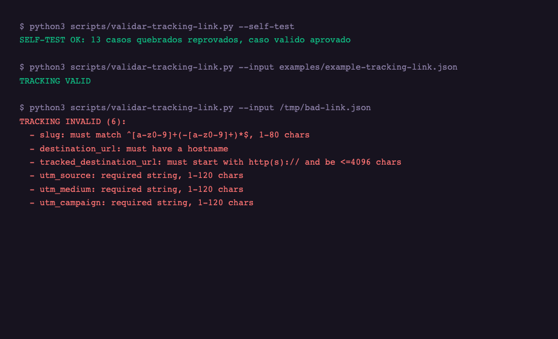

<p align="center">
  
</p>

<p align="center">
  
</p>

<h1 align="center">My_UTMs_Make_Me_Proud</h1>

<p align="center">
  <strong>The tracking layer of a marketing system that actually knows which channel sold.</strong><br>
  A portable, deterministic tracking-link engine for Claude Code and Codex — creation, click, attribution, health and metrics as one auditable cycle.
</p>

<p align="center">
  <a href="./LICENSE"></a>
  
  
  
  
</p>


<p align="center">
  <video src="assets/demo.mp4" autoplay muted loop playsinline width="640"></video><br>
  <sub>The cycle, animated — a link through the 302 gate into three tracked channels</sub>
</p>

> **Independent project:** My_UTMs_Make_Me_Proud is not affiliated with, endorsed by, or sponsored by any analytics vendor. It implements established marketing-attribution patterns with deterministic tooling — no third-party copy, no trademarks, no claims about tools it does not ship.

---

## Table of contents

- [Em 30 segundos](#em-30-segundos)
- [Para quem é este produto?](#para-quem-é-este-produto)
- [Instalação](#instalação)
- [Início rápido](#início-rápido)
- [Comandos](#comandos)
- [Características](#características)
- [Os contratos, em profundidade](#os-contratos-em-profundidade)
- [As decisões que moldaram este repo](#as-decisões-que-moldaram-este-repo)
- [O validator, regra por regra](#o-validator-regra-por-regra)
- [Guia de integração para desenvolvedores](#guia-de-integração-para-desenvolvedores)
- [Roadmap do ecossistema](#roadmap-do-ecossistema)
- [Em comparação com ferramentas manuais / de agência / comerciais](#em-comparação-com-ferramentas-manuais--de-agência--comerciais)
- [Casos de uso](#casos-de-uso)
- [Exemplo de saída](#exemplo-de-saída)
- [Arquitetura](#arquitetura)
- [Metodologia](#metodologia)
- [Novidades na versão 1.0.0](#novidades-na-versão-100)
- [Limitações](#limitações)
- [Requisitos](#requisitos)
- [Desinstalar](#desinstalar)
- [Extensões](#extensões)
- [Ecossistema](#ecossistema)
- [Documentação](#documentação)
- [Perguntas frequentes](#perguntas-frequentes)
- [Colaboradores da comunidade](#colaboradores-da-comunidade)
- [Licença](#licença)
- [Contribuindo](#contribuindo)
- [Autor](#autor)

---

## Em 30 segundos

You create a link. It gets a slug, a destination, and UTMs — validated by a deterministic script with thirteen regression cases, so a broken link cannot enter the system. A visitor clicks it: the click is recorded once (replays cannot double-count), and the visitor is redirected in the same breath — because a metric must never stand between a visitor and the destination. The lead form records which link introduced the lead; the purchase records which link closed it. A health probe watches every link, with an SSRF guard and datacenter-block detection, so "the links stopped working" is an alert, not a quarterly surprise. A metrics contract calendar-fills 7/30/90-day windows so the report at the end of the quarter is numbers over verified links — not opinions over a spreadsheet.

That is the entire product. The rest of this README is the terrain: the rules, the reasoning, and the exact behavior of each stage. If the thirty-second version already sounds like what you needed, jump to [Início rápido](#início-rápido) and run the self-test — it takes ten seconds and tells you whether the machine is honest.

---

## Para quem é este produto?

This skill exists for people who have already learned the hard lesson: **traffic without attribution is noise.** If you run campaigns and cannot answer "which channel produced this sale" with a number, not an opinion, this is for you.

**Agencies and consultancies.** You run campaigns across clients, channels and landing pages. Every campaign needs its own link, its own UTM set, its own health state — and the client will ask you, weeks later, "what did this link do?" My_UTMs gives you a deterministic contract so the answer is one query away, not one afternoon of spreadsheet archaeology.

**In-house marketing teams shipping LPs and nurture flows.** Your landing pages produce leads, your email engine follows up, your sales team closes. If those three systems do not share a tracking contract, the funnel report is fiction. This skill is the layer the other two consume: the landing page references it, the email engine references it, and neither has to reinvent attribution.

**Developers who integrate channels for products.** Every new channel — email marketing, workshops, paid ads, WhatsApp, referral programs — used to mean a new bespoke UTM scheme and a new place to look for metrics. The nucleus is channel-agnostic by construction: each new channel becomes one integration directory (`integracoes/<canal>/`), and the cycle (creation → click → attribution → health → metrics) does not change.

If you only send occasional links and never need to justify spend, you do not need this. Keep it simple. This skill earns its weight when the number of links, channels and questions grows past what a spreadsheet survives.

---

## Instalação

### Option A — Claude Code skill (recommended)

```bash
git clone https://github.com/luisroquette/My_UTMs_Make_Me_Proud.git ~/.claude/skills/my-utms-make-me-proud
```

Then restart Claude Code — the skill loads as `my-utms-make-me-proud`. No API keys, no services, no runtime dependencies: the repository is plain Markdown contracts plus one deterministic Python validator.

### Option B — manual download

```bash
# read before running, as always
curl -L https://github.com/luisroquette/My_UTMs_Make_Me_Proud/archive/refs/heads/main.tar.gz | tar xz
mv My_UTMs_Make_Me_Proud-main my-utms-make-me-proud
```

### Option C — Codex

The repository ships `agents/openai.yaml`, so the same skill loads under Codex with the same contracts.

**Requirement:** Python 3.10+ for the validator only. The contracts are plain Markdown — they work with any agent, any stack, any language.

---

## Início rápido

```bash
# 1. Validate the machine — 13 regression cases, deterministic
python3 scripts/validar-tracking-link.py --self-test

# 2. Validate your first link
python3 scripts/validar-tracking-link.py --input examples/example-tracking-link.json

# 3. Read the cycle (5 stages, 10 minutes)
cat SKILL.md
```

The self-test is the first thing every contributor runs. It is the contract in executable form: 13 cases that break when someone changes the slug shape, accepts a destination without a host, allows a `/t/` loop, or weakens the UTM rules. If the self-test fails, the skill is broken — fix that before anything else.

A valid link looks like this:

```json
{
  "name": "Campanha de exemplo",
  "slug": "exemplo-campanha",
  "destination_url": "https://exemplo.com.br/lp/demo",
  "tracked_destination_url": "https://exemplo.com.br/lp/demo?utm_source=referral&utm_medium=site&utm_campaign=demo",
  "utm_source": "referral",
  "utm_medium": "site",
  "utm_campaign": "demo",
  "is_active": true
}
```

The shape is not decorative. `tracked_destination_url` **is** `destination_url` plus the UTM query string — the validator enforces that derivation, so a link that silently drops its campaign parameter cannot enter the system.

---

## Comandos

The skill is an operating cycle, not a bag of utilities. Five stages, each with a contract document in `references/nucleo/`, each deterministic.

| Stage | What it does | Contract |
|---|---|---|
| 1. **Creation** | Normalize the slug, derive UTMs from the hostname map, reject query strings on the destination, write the link idempotently | `references/nucleo/criacao.md` |
| 2. **Click** | Resolve the destination, record the granular event idempotently (`click_id`), increment the aggregate only on insert, redirect 302 with `no-store`/`no-referrer` | `references/nucleo/clique.md` |
| 3. **Attribution** | First-click and last-click per lead, with the two naming conventions documented (camelCase on the lead, snake_case on the purchase) | `references/nucleo/atribuicao.md` |
| 4. **Health** | Double probe (HEAD + confirmation), SSRF-guarded fetching with per-hop redirect validation, alert states, datacenter failure detection | `references/nucleo/saude.md` |
| 5. **Metrics** | Daily aggregates, 7/30/90-day calendar-filled windows, absence ≠ zero | `references/nucleo/metricas.md` |

The validator covers stage 1's form contract:

```bash
python3 scripts/validar-tracking-link.py --input <draft>.json   # rode da RAIZ da skill
python3 scripts/validar-tracking-link.py --self-test            # 13 regression cases
```

Every stage has one rule in common with the others: **metrics never block the visitor.** If recording fails, log it and redirect anyway. The redirect is the product; the metric is the side effect. No metric error may ever stand between a visitor and the destination.

---

## Características

**Idempotent creation.** A link is identified by its slug. Creating the same slug twice is not an error — it is a reuse. The contract specifies exactly how the second write behaves (refresh the destination if the offer changed, keep the slug). Campaigns that run daily do not accumulate duplicate rows.

**Loop-proof destinations.** The validator rejects destinations that point at another tracking link (`/t/`, case-insensitive) — the classic mistake that turns one click into an infinite redirect chain and corrupts every downstream metric.

**Query-free destinations by contract.** The tracked URL is `destination_url + "?" + utm_*`. A destination that already carries a query string can never validate — so the validator rejects it on creation, instead of letting it produce a double-`?` URL in production.

**Idempotent click recording.** The granular click event is keyed on `click_id`. A replay never double-counts: the event insert and the daily aggregate increment happen in one transaction, and the aggregate increments only when the insert actually created the row (`RETURNING (xmax = 0)`). This is the "both layers or neither" rule.

**First-click and last-click attribution, both, in one contract.** Most attribution systems pick one window and call it a day. The contract records both: `firstTrackingClickId`/`lastTrackingClickId` on the lead (camelCase), `first_marketing_click_id`/`last_marketing_click_id` on the purchase (snake_case). First-click answers "which channel introduced the lead"; last-click answers "which channel closed the deal". They answer different questions and must not be merged.

**SSRF-guarded health checks.** The health stage probes destinations the system does not control. Before resolving a host: block private/loopback/link-local/multicast ranges, intercept DNS and reject resolutions into blocked IPs, and re-validate the guard on **every redirect hop** — or do not follow redirects at all. A health probe without this guard is a server-side request forgery vector pointed at your own infrastructure.

**Calendar-filled metrics.** The metrics contract requires 7/30/90-day windows to be calendar-filled: a missing day is `0`, never absent. Averages computed over missing rows lie; a report that skips days tells you the tool is broken, not the campaign.

**Deterministic validator with a growing regression suite.** Every bug class found in review becomes a case in the self-test. The suite started at 8 cases and is at 13: no-hostname destinations, uppercase `/T/` loops, empty UTM values, invalid `expires_at` ISO, non-object JSON input, query-carrying destinations — each one a bug class that existed, was fixed, and can never silently return.

**Channel-agnostic by construction.** The nucleus does not know what a "campanha" is. Channels plug in through `integracoes/`: the landing-page integration (`references/integracoes/lp.md`) is the first, with a template for the next ones — email marketing, workshops, ads, WhatsApp. Each channel owns its hostname → `utm_source` map, so adding a channel never touches the nucleus.

---

## Os contratos, em profundidade

The README above is the map. This section is the terrain — the rules as they exist in `references/nucleo/`, with the reasoning behind each one. If you are integrating this skill into a real stack, this is the part that matters.

### Criação — the rules a link must obey before it exists

**Slug normalization is mechanical, not judgment.** Strip accents, lowercase, non-alphanumerics become hyphens, repeated hyphens collapse. When the normalized slug exceeds 80 characters, truncate it to `80 − len(hash)` and append an FNV-1a hash (32-bit, base36) computed over the **entire normalized slug** — never over the truncated prefix, or long names sharing a prefix would still collide. Plain truncation without the hash is forbidden: two similar campaign names would silently share a public URL.

**The slug is a public identity.** `/t/<slug>` is a URL people have clicked, bookmarked, pasted into reports. Renaming a slug is a destructive edit — the contract says so in words, because the database cannot enforce it and the tooling cannot undo it.

**Destinations are query-free by contract.** The tracked URL is defined as `destination_url + "?" + utm_*`. A destination carrying its own query string produces a double-`?` URL that no parser reads the same way twice. The validator rejects it at creation — the alternative is discovering it in production.

**UTM derivation comes from a hostname map.** Each channel integration owns a maintained map `hostname → utm_source`. Hand-typed UTM sources drift; a map drifts in exactly one file, and the drift is reviewable.

**Idempotent writes.** Creating an existing slug is a reuse, not an error. The second write refreshes the destination if the offer changed and keeps the slug — campaigns that run daily do not accumulate duplicate rows, and the historical series stays unbroken.

**Embedded credentials and tracking loops are rejected.** A destination with `user:pass@` embedded, or one pointing at another `/t/` link (case-insensitive — `/T/` is the same escape), fails creation. These are not quality concerns; they are the two bug classes that corrupt every downstream metric.

### Clique — what happens between the tap and the landing

**Resolve first, always.** Validate the slug against the regex (invalid → 404). Resolve the destination: active, not deleted, not expired — via the service-role resolver, with a direct-table fallback that re-checks expiry. Resolution fails → 404 with a stable message; the entire mechanism is down → 503 "Tracking unavailable". The visitor must never receive a half-explained failure.

**Record in one transaction.** The granular event is idempotent on `click_id`; the daily aggregate increments **only when the insert actually created the row** — detected with `RETURNING (xmax = 0)`, because an `ON CONFLICT DO UPDATE` also returns a row on replay. Both layers move together or neither does. A replay must never double-count, and the rule that prevents it is written in SQL, not in intent.

**Redirect 302, with `no-store` and `no-referrer`.** The redirect is the product. The headers exist so the tracking link does not leak the previous page and does not get cached into a stale jump.

**Metrics never block the visitor.** Recording failed? Log it and redirect anyway. This rule is absolute and appears in every stage contract: no metric error may ever stand between a visitor and the destination. A tracking system that takes the redirect down with it has failed its one job.

**Bot and prefetch hygiene.** HEAD requests do not record clicks. Prefetch signals do not record clicks. The distinction is enforced at the click handler, because a link that counts prefetches as traffic is reporting fiction.

### Atribuição — two questions, two IDs, never merged

**First click answers "which channel introduced the lead". Last click answers "which channel closed the deal".** The contract records both, at two moments, with two naming conventions:

- On the lead: `firstTrackingClickId` / `lastTrackingClickId` — camelCase.
- On the purchase: `first_marketing_click_id` / `last_marketing_click_id` — snake_case.

The naming difference is not inconsistency — it is a boundary marker. It tells the reader which table the column belongs to without a schema prefix, and it is preserved exactly because production integrations on both sides already depend on it.

**Absence is recorded as absence.** A lead who never clicked a tracking link has a `NULL` first-click id — not a zero, not an empty string. Reports that treat `NULL` as zero will claim a channel produced a lead it never saw.

### Saúde — the probe that assumes the destination is trying to trick it

**Double probe.** A primary HEAD request, confirmed by a second check. One probe alone mislabels transient failures as broken links and wakes people up at 3 a.m. for nothing.

**States are a ladder, not a boolean.** `unchecked → healthy | warning | broken`, with `health_http_status`, `health_checked_at` and `health_error_code` recorded. A link that returned 404 once is in a different state from one that returned 404 for three days — the ladder preserves that difference.

**The SSRF guard runs before every probe.** The probe fetches destinations it does not control. Before resolving a host: block private, loopback, link-local and multicast IPv4 and IPv6 ranges; intercept DNS and reject any hostname resolving into a blocked IP (`private_host`); and re-validate the guard on **every redirect hop** — or do not follow redirects at all. A public destination that 302-redirects to `http://169.254.169.254/` bypasses the guard entirely if only the first host is checked.

**The datacenter lesson.** This rule exists because the reference system lost tracking silently when links were opened from datacenter IP ranges. A health system that only checks "does the destination exist" misses "does the destination exist *for the people clicking*". The contract requires datacenter-failure detection as its own alert class.

### Métricas — windows that cannot lie

**Calendar-filled windows.** 7, 30 and 90-day windows are calendar-filled: a day with no data is a zero for that day, never an absent row. Averages over missing rows lie; a report that skips days is telling you the tool is broken, not the campaign.

**Absence ≠ zero, again.** "No clicks recorded" and "clicks not yet aggregated" are different states and are stored differently. One is a fact; the other is a race.

**Limits are bounded and explicit.** Query limits (25/250), rate limits (100) and retry bounds (6) are constants in the contract, not tuning knobs left to the implementer. Two implementations reading the same contract produce the same behavior — that is the point of a contract.

---

## As decisões que moldaram este repo

The skill was not designed by committee — it was extracted from a production system through a series of owner decisions, each of which left a mark on the architecture. They are recorded here because they explain *why* the repo looks the way it does:

1. **A new repository, not a plug.** The tracking layer deserved its own identity instead of living inside the LP engine.
2. **Portable methodology + deterministic scripts.** The knowledge ships as contracts; the enforcement ships as code with no LLM in the loop.
3. **The tracking link owns the contract.** Consumers reference it — they never redefine it. This is the single rule that keeps the ecosystem coherent as it grows.
4. **The complete cycle, from day one.** Creation → click → attribution → health → metrics. Half a cycle is worse than none: attribution without health tells you the numbers, but not whether to trust them.
5. **The name is a promise.** "My_UTMs_Make_Me_Proud" — the bar is that your UTMs make you proud when the quarterly report runs.
6. **Born at 1.0.0.** The reference system had already survived production; the first public release shipped the full cycle with a tag.
7. **Integrations are recommended, not mandatory.** The LP plug upgraded to v2.1.0 because it chose to; the contract works standalone.
8. **Structure mirrors the LP skill, with one deliberate split:** a channel-agnostic `nucleo/` plus an `integracoes/` that accumulates channels one template at a time.

---

## O validator, regra por regra

`scripts/validar-tracking-link.py` is 184 lines of Python with no dependencies and no LLM calls. Every rule below is enforced mechanically, and every rule below has at least one regression case that fails if the rule is removed. This section documents the complete rule set — it doubles as the specification for anyone reimplementing the gate in another language.

### The universal fields

- **`name`** — required string, 1-100 characters. The name is what humans read in the admin panel; the slug is what machines route. A link without a name is a link nobody can find.
- **`slug`** — required string, 1-80 characters, matching `^[a-z0-9]+(-[a-z0-9]+)*$`. No uppercase, no underscores, no spaces, no leading or trailing hyphens, no consecutive hyphens. The regex is the same shape the production route uses — a slug the validator accepts is a slug the router will serve.
- **`destination_url`** — required string, `http://` or `https://`, at most 2048 characters, **with a hostname**, **with no query string**, with no embedded credentials, and not pointing at another tracking link. Four separate failure modes, four separate error messages, four regression cases.
- **`tracked_destination_url`** — required string, `http(s)://`, at most 4096 characters, and — when the destination is valid — **derived from it**: it must start with `destination_url + "?"` and carry non-empty `utm_source`, `utm_medium` and `utm_campaign` parameters. The derivation check is the heart of the gate: it makes "a link that silently lost its campaign parameter" structurally impossible.
- **`utm_source` / `utm_medium` / `utm_campaign`** — required strings, 1-120 characters each. These are the fields downstream reports group by; a link with an empty source produces a channel called "" in every report.
- **`utm_content` / `utm_term`** — optional strings, at most 120 characters when present. Present-and-wrong-shape fails; absent is fine.
- **`is_active`** — optional boolean. Present-and-not-boolean fails. The lifecycle default is explicit in the consumer contract, not smuggled through the validator.
- **`expires_at`** — optional, but when present it must be a **parseable ISO timestamp** (`datetime.fromisoformat`, with `Z` normalized). A date the clock cannot parse is a date that will never expire — or worse, that expires immediately depending on who reads it.

### The regression ledger

Each case below was a real bug class — found in review, fixed, and pinned forever in `--self-test`:

| # | Case | Bug class it pins |
|---|---|---|
| 1 | slug with underscore and uppercase | normalization drift |
| 2 | empty slug | missing identity |
| 3 | destination with embedded credentials | secret leakage through URLs |
| 4 | destination pointing at `/t/` | infinite redirect loop |
| 5 | uppercase `/T/` loop | case-sensitivity escape of the loop guard |
| 6 | missing `utm_medium` | incomplete attribution |
| 7 | empty `utm_source` | the "" channel |
| 8 | tracked not derived from destination | silent UTM loss |
| 9 | empty name | unsearchable links |
| 10 | destination without hostname | `https:///x` class — URL that is not a URL |
| 11 | destination with query string | the double-`?` URL class |
| 12 | `utm_campaign` present but empty | parameter without a value |
| 13 | invalid `expires_at` | unparseable lifecycle |

The self-test runs the valid example through the gate and asserts it passes, and runs all thirteen broken cases and asserts each fails. The suite can only grow: every future bug class adds a case in the same commit as its fix — the contribution bar documented in [Contribuindo](#contribuindo).

---

## Guia de integração para desenvolvedores

This section is the practical path from "cloned the repo" to "my channel produces tracked links". It assumes you are integrating into a real stack — the sibling repos show complete reference implementations.

### Step 1 — Decide the channel's identity

Every channel owns three things in its integration file: the **hostname → `utm_source` map** (which hosts belong to this channel), the **default `utm_medium`** (email, referral, ads, social), and the **link shapes** (which slug patterns the channel emits). Write these down first — the rest of the integration is mechanical once they exist.

### Step 2 — Create the integration directory

```bash
cp references/integracoes/modelo-nova-integracao.md references/integracoes/meu-canal.md
```

The template has the three sections above plus the rules every integration must obey: reference the nucleus, never redefine it; derive UTMs from the map, never hand-type; emit links through creation-stage rules only.

### Step 3 — Wire creation into your product

Wherever your product creates a marketing URL, call creation with the contract's fields. Feed the draft through the validator in CI:

```bash
python3 scripts/validar-tracking-link.py --input meu-link.json
```

A failing CI build is the normal state of a new integration — the validator is strict on purpose, and the error messages say exactly which rule was broken.

### Step 4 — Implement click and attribution against the contracts

The click contract tells you the exact behavior: 302 with `no-store`/`no-referrer`, transactional recording with `RETURNING (xmax = 0)`, HEAD and prefetch excluded. The attribution contract tells you the two moments to record (`firstTrackingClickId` on lead capture, `last_marketing_click_id` on purchase) and the casing of each column. Implement to the letter; the letter is what makes the reports join.

### Step 5 — Health and metrics

Point the health probe at your links with the SSRF guard from `saude.md`. Calendar-fill your metric windows per `metricas.md`. The two contracts together answer "are the links working" and "what did they do" — without them, attribution is numbers over an unverified substrate.

### Troubleshooting

- **The visitor gets a 404 on `/t/<slug>`** — the slug was renamed (public URL changed) or the link was archived. The contract does not auto-migrate renames; check the link's lifecycle state.
- **The visitor gets a 503 "Tracking unavailable"** — the resolution mechanism is down. This is the designed failure mode: visible and honest, instead of a silent wrong redirect.
- **The validator prints `TRACKING INVALID` in CI** — read the error list literally. Each line names the field and the rule. Fix the draft, not the validator.
- **The aggregate does not match the granular events** — someone incremented the aggregate outside the transaction, or on replay. The contract requires "both layers or neither"; find the code path that writes one without the other.
- **The health probe flags a healthy link as broken** — check whether the probe followed a redirect into a blocked range (the guard reports `private_host` by design) or whether the datacenter-block detection is active (links can be fine from real users and blocked from datacenter IPs at the same time).

---

## Roadmap do ecossistema

The repository is not a snapshot — it is a layer in a system that keeps growing. The roadmap is public because the priorities are decisions, not surprises:

**Now — consolidation.** The three sibling skills (this one, the LP engine, the email engine) are published and interoperating through the contract. The immediate work is hardening: every new bug class becomes a regression case, every integration gets its template filled.

**Next — the unified dashboard.** The metrics contract already defines the 7/30/90 calendar-filled windows a dashboard consumes; the sibling LP skill defines the pluggable dashboard contract. The two meet when the dashboard shows clicks by channel, lead attribution and link health in one screen — implemented once, consumed by every integration.

**Then — new channels.** Email marketing, workshops, paid ads, WhatsApp — each arrives as a directory under `integracoes/` and a hostname map. Nothing in the nucleus moves. The template exists precisely so a new channel is an afternoon of contract-writing, not a redesign.

**Later — the knowledge graph.** When the number of links, channels and rules grows, the contracts themselves become the corpus for a knowledge graph — so "which rule touches which channel" is a query, not a memory.

The order matters: consolidation before dashboard before channels, because every later layer consumes the guarantees of the earlier one.

---

## Em comparação com ferramentas manuais / de agência / comerciais

| | Manual (UTMs à mão) | Agência | Ferramenta comercial | **My_UTMs_Make_Me_Proud** |
|---|---|---|---|---|
| Contrato único entre canais | ✗ cada planilha tem a sua convenção | Depende do analista | Sim, mas fechado | **Sim — e ele é o produto** |
| Custo por link novo | Minutos de atenção | Horas faturáveis | Zero marginal | **Zero + um arquivo de integração** |
| Auditável por você | ✗ | Só o relatório final | ✗ caixa-preta | **Sim — contratos em Markdown, validator executável** |
| Funciona offline / sem vendor | Sim | — | ✗ | **Sim — zero dependências de runtime** |
| Determinístico | ✗ erro humano | ✗ | Parcial | **Sim — self-test de 13 casos** |
| Atribuição first + last click | ✗ | Manual | Sim | **Sim, com as duas convenções documentadas** |
| Portável entre clientes | ✗ | ✗ | Licenças | **MIT — clone por cliente** |
| Anti-loop / anti-SSRF por contrato | ✗ | ✗ | Interno, invisível | **Declarado e testável** |

Use a planilha while the spreadsheet still answers your questions. Use an agency when you are buying judgment, not plumbing. Use a commercial tool when you need its distribution features. Use My_UTMs when you need the *contract* — the shared definition of a link, a click and a conversion that your landing pages, your email engine and your reports can all consume without three different interpretations.

---

## Casos de uso

### 1. The LP + nurture funnel

A landing page captures a lead. The email engine follows up for 25 days. Sales closes. Three systems, three codebases, one question at the end of the quarter: which channel produced the revenue?

With the contract: the LP creates the lead with `firstTrackingClickId` from the link the visitor clicked; the nurture engine reuses the same contract when it sends its own tracked CTAs (`mailmkt-<slug>` in the sibling skill); the purchase carries `first_marketing_click_id`/`last_marketing_click_id`. The report joins three tables on two IDs instead of reconciling three spreadsheets.

### 2. Multi-channel campaigns for one product

Workshop links, blog links, paid ads, referral links. Each channel gets its own integration directory and its own hostname map, so `utm_source` is derived consistently from the destination host — not typed by hand differently each time. When a channel's naming drifts, it drifts in one file, not in forty links.

### 3. An agency running the same playbook across clients

Every client gets a clone of the skill, the same validator, the same contracts. The deliverable stops being "a report" and becomes "a tracking system the client owns and can audit". That is the difference between a retainer and a dependency.

---

## Exemplo de saída

The validator is designed for terminal use and CI. Real output, unedited:

```
$ python3 scripts/validar-tracking-link.py --self-test
SELF-TEST OK: 13 casos quebrados reprovados, caso valido aprovado

$ python3 scripts/validar-tracking-link.py --input examples/example-tracking-link.json
TRACKING VALID

$ python3 scripts/validar-tracking-link.py --input /tmp/bad-link.json
TRACKING INVALID (6):
  - slug: must match ^[a-z0-9]+(-[a-z0-9]+)*$, 1-80 chars
  - destination_url: must have a hostname
  - tracked_destination_url: must start with http(s):// and be <=4096 chars
  - utm_source: required string, 1-120 chars
  - utm_medium: required string, 1-120 chars
  - utm_campaign: required string, 1-120 chars
```



And the production behavior the contract encodes — verified against the reference system:

```
GET /t/lp-treinamento-lovable
302 → https://cfgauss.com.br/lp/lovable-pro?utm_source=cfgauss&utm_medium=referral&utm_campaign=lp-treinamento-lovable
headers: no-store, no-referrer
```

Every rule in the contract maps to a behavior like this one. If a rule cannot be expressed as a behavior, it is removed from the contract.

---

## Arquitetura

```
nucleo/            the cycle — creation, click, attribution, health, metrics
  criacao.md       slug normalization, UTM derivation, idempotent writes
  clique.md        resolve → record (transactional) → 302
  atribuicao.md    first/last click, naming conventions
  saude.md         double probe, SSRF guard, alerts
  metricas.md      7/30/90 calendar-filled windows
integracoes/
  lp.md            the landing-page channel (first integration)
  mailmkt.md       the email marketing channel (second integration)
  modelo-nova-integracao.md   template for the next channels
scripts/
  validar-tracking-link.py    deterministic form validator + 13 regression cases
examples/
  example-tracking-link.json  canonical valid link
agents/
  openai.yaml                 Codex loader
```

Three principles hold the architecture together:

**The tracking link owns the contract.** Consumers reference it; they never redefine it. The sibling skills (`My_LP_Makes_Neil_Proud`, `My_MailMKT_makes_Neil_Proud`) do exactly this — when the LP needs a tracked link, it points at the nucleus instead of reimplementing UTM logic.

**The nucleus is channel-agnostic.** Nothing in `nucleo/` mentions a specific product, a specific host, or a specific channel. The moment a rule starts mentioning "the campaign", it belongs in an integration, not in the nucleus.

**Analytics never blocks delivery.** In every stage — creation, click, health — the failure mode is degrade-and-log, never block. A tracking system that takes the store down with it has failed its one job.

---

## Metodologia

The contracts were not written as documentation after the fact. They were extracted from a production system that ran for weeks, found its failure modes in real traffic, and then had each lesson written down as a rule with a test.

**Determinism over cleverness.** Every rule must be executable by a machine with no judgment calls. The validator is the proof: 13 regression cases, same input → same verdict, forever. If a rule needs a human to interpret it, it is reworded until it does not.

**Absence is not zero.** A missing metric, a missing day, a missing field — each is represented as *missing*, never silently converted to zero. Zero means "we measured nothing happened"; missing means "we do not know". Reports that conflate the two hide outages.

**The rename problem is documented, not hidden.** Renaming a slug changes a public URL (`/t/<slug>`). The contract states it plainly: renames do not propagate to already-emitted links. Tools that pretend otherwise produce broken links in production; this one tells you the truth so you design around it.

**Every bug class becomes a regression case.** The self-test is not a demo — it is the ledger of bugs that were real: no-hostname destinations, case-sensitive loop escapes, empty UTM values, non-object JSON. Each fix landed with its case in the same commit. The suite can only grow; it never shrinks.

**Health checks are adversarial, not polite.** The probe assumes the destination will try to trick it: credentials in URLs, redirects to private networks, DNS rebinding. The guard re-validates every hop. A polite health check is a false sense of security.

---

## Novidades na versão 1.0.0

The repository was born complete — v1.0.0 shipped the full cycle with a tag and a GitHub Release, because the reference system behind it had already been in production. What the first release delivered:

- **The complete 5-stage cycle** — creation, click, attribution, health, metrics — as channel-agnostic contracts in `nucleo/`.
- **The LP as the first integration**, with `modelo-nova-integracao.md` as the template that accumulates the next channels (email marketing, workshops, ads, WhatsApp).
- **The deterministic validator** with its initial regression suite, extended during the hardening pass to 13 cases.
- **The fidelity contract**, verified against production traffic: the `/t/` → 302 behavior, the camelCase/snake_case attribution pair, and the documented absence of rename propagation.

## Novidades na versão 1.1.0

The second integration landed: the email marketing contract.

- **`references/integracoes/mailmkt.md`** — extracted from the CF Gauss production binding (18/08/2026): one idempotent `mailmkt-<slug>` link per campaign run, `mailmkt_` UTM prefix, double tracking (`/t/` + per-recipient nurture events), the send-time raw-URL gate, coupon-token expiry, and the documented absence of per-recipient links.
- The integration template now points at `mailmkt.md` as the reference email example.

Changelog: [CHANGELOG.md](./CHANGELOG.md) · Releases: [GitHub Releases](https://github.com/luisroquette/My_UTMs_Make_Me_Proud/releases)

---

## Limitações

This skill declares its boundaries instead of discovering them in production:

- **Renames do not propagate.** Renaming a slug changes a public URL; links already emitted keep the old slug. There is no automatic migration — by design, and it is documented so consumers plan around it.
- **Health checks do not follow redirects** (or must re-validate the guard on every hop). A destination that redirects to a private IP is reported as unhealthy, not probed.
- **It is a contract, not a hosted service.** The skill does not run a server, does not store clicks, does not host your dashboard. It tells your stack exactly how to build the tracking layer; the sibling skills show reference implementations.
- **No bot-click heuristics in the nucleus.** Bot/prefetch filtering rules exist in the click contract, but the judgment of what counts as a bot is an integration concern, per channel.

If a limitation blocks you, that is a design conversation — the contracts are explicit precisely so that conversation happens before the traffic does.

---

## Requisitos

- Python 3.10+ (validator only)
- Claude Code or Codex (the skill is agent-oriented Markdown; nothing else is required)
- No API keys, no database, no network access for the core cycle

---

## Desinstalar

```bash
rm -rf ~/.claude/skills/my-utms-make-me-proud
```

Nothing is installed outside the skill directory. No services, no hooks, no global state.

---

## Extensões

The skill is the tracking layer of a larger system. The extensions that consume it:

- **My_LP_Makes_Neil_Proud** — the landing-page engine. Its plug (v2.1.0) references this repository: every LP CTA ships as a tracking link created under this contract, and the lead records `firstTrackingClickId`/`lastTrackingClickId`.
- **My_MailMKT_makes_Neil_Proud** — the email engine. Every marketing CTA ships as a `mailmkt-<slug>` tracking link; body links get per-destination slugs. The binding is documented in [`references/integracoes/mailmkt.md`](./references/integracoes/mailmkt.md).
- **Next planned integrations** — workshops, paid ads, WhatsApp — each following `modelo-nova-integracao.md`.

---

## Ecossistema

| Skill | Layer | Relationship |
|---|---|---|
| **My_UTMs_Make_Me_Proud** (this repo) | Tracking | Owns the contract |
| My_LP_Makes_Neil_Proud | Landing pages | References it — first producer of tracked links |
| My_MailMKT_makes_Neil_Proud | Email nurture | References it — every CTA tracked |

The three skills form one marketing system: capture → nurture → attribution, with one source of truth for what a click means.

---

## Documentação

- [SKILL.md](./SKILL.md) — the operating cycle and quick start
- [references/nucleo/](./references/nucleo/) — the five stage contracts
- [references/integracoes/](./references/integracoes/) — channel integrations and the template
- [references/versionamento.md](./references/versionamento.md) — versioning rules
- [examples/](./examples/) — canonical inputs

---

## Perguntas frequentes

**Is it free?** Yes. MIT. No tiers, no hosted anything, no account.

**Does it replace Google Analytics / GA4?** No. It is the attribution contract for links you own; GA4 remains the analytics surface. The two record different layers.

**Do I need to host anything?** No. The skill defines the system; the reference implementations live in the sibling repos. Host when you build the integration into your stack.

**Why a Python validator instead of a JSON Schema?** Because the contract rules include semantics a schema cannot express — derivation (`tracked == destination + UTMs`), hostname presence, query-freeness, loop rejection. The validator is the schema *plus* the rules, as executable code, with regression cases.

**What happens when the tracking table is down?** The click contract says: resolve fails → 404 with a stable message; the whole mechanism down → 503 "Tracking unavailable". And the visitor's redirect is never blocked by a metric failure.

**Can I add a new channel myself?** Yes — copy `modelo-nova-integracao.md`, define the hostname → source map, write the link shapes. The nucleus does not change.

**How do I know a link is healthy?** The health contract: double probe (HEAD + confirmation), SSRF guard with per-hop redirect validation, states `unchecked → healthy | warning | broken`, and alert codes — including the datacenter-block class that silently kills links.

**Why "absence ≠ zero" everywhere?** Because the two states demand different actions. A day with zero clicks means "the campaign underperformed" — investigate the creative. A day with no data means "the tracking stopped working" — investigate the pipeline. Conflating them makes a broken tracker look like a failing campaign, and the wrong team gets the alarm.

**Why is the validator Python and the contracts Markdown?** The contracts must be readable by any agent in any stack; Markdown is the only format with no adoption cost. The validator must run anywhere with zero dependencies; Python 3.10+ is installed on every developer machine and CI runner. Together: prose for humans, code for the gate, no lock-in.

**What does "the tracking link owns the contract" mean in practice?** It means this repository is the only place where the meaning of "a click" is defined. When the LP engine or the email engine needs tracking, they reference these files instead of inventing their own version. One definition, three consumers, zero drift — and when the definition changes, it changes once, visibly, in one commit.

**Can the validator run in my CI?** Yes — it is a single-file Python script with no dependencies. Exit 0 = valid, exit 1 = invalid with the error list on stdout. Wire it as a job on every PR that touches link drafts, and broken links stop being a production discovery.

**What is the success bar for this repo?** The name says it: your UTMs make you proud. Concretely — when the quarterly report runs, you can state which channel produced each sale, with first-click and last-click attribution, backed by a validator that runs the same verdict every time. If you cannot state it, the repo has failed its purpose; if you can, it has earned its name.

---

## Colaboradores da comunidade

This repository is young — the contributor table is open. The first entries will be the people who find a bug class the self-test does not cover yet and add its regression case. That is the contribution that matters here.

---

## Licença

MIT — see [LICENSE](./LICENSE).

---

## Contribuindo

The bar is one rule: **every fix to a validator rule lands with its regression case in the same commit.** Run `python3 scripts/validar-tracking-link.py --self-test` before opening a PR. Contracts change through discussion in the issue first, code second.

---

## Autor

**Luis Roquette** — Anthropic Select Services Partner, building the CF Gauss marketing stack (LP engine → email engine → tracking) as portable, auditable open-source skills.

<p align="center">
  <a href="https://github.com/luisroquette/My_LP_Makes_Neil_Proud">My_LP_Makes_Neil_Proud</a> ·
  <a href="https://github.com/luisroquette/My_MailMKT_makes_Neil_Proud">My_MailMKT_makes_Neil_Proud</a> ·
  <a href="https://github.com/luisroquette/My_UTMs_Make_Me_Proud">My_UTMs_Make_Me_Proud</a>
</p>
